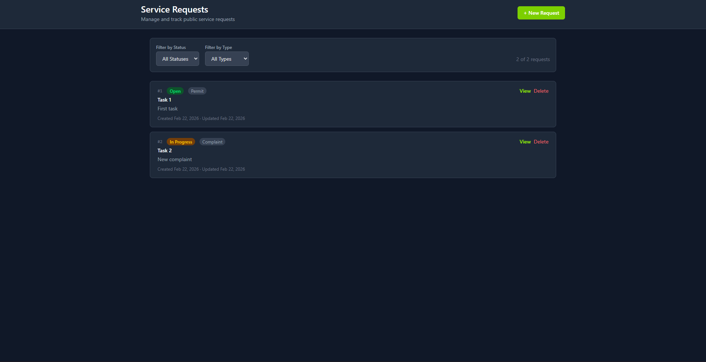

# Public Service Request

> A full-stack enterprise application built with .NET 10, Angular, and Docker.

This repository contains a containerized web application designed for performance and scalability. The backend is powered by a **.NET 10** Web API, the frontend is a modern **Angular** application, and the entire stack (including the database) is orchestrated using **Docker Compose**.



---

## Tech Stack

- **Backend:** .NET 10 (MVC), Entity Framework Core
- **Frontend:** Angular, TypeScript, TailwindCSS
- **Database:** PostgreSQL
- **Infrastructure:** Docker, Docker Compose

---

## Prerequisites

Before you begin, ensure you have the following installed on your local machine:

- [Docker Desktop](https://www.docker.com/products/docker-desktop)
- [.NET 10 SDK](https://dotnet.microsoft.com/download/dotnet/10.0)
- [Node.js](https://nodejs.org/) (v20+ recommended)
- [Angular CLI](https://angular.io/cli) (`npm install -g @angular/cli`)

---

## Project Structure

```text
PublicServiceRequest/
├── Backend/                                            
│   ├── PublicServiceRequestBackend/                 
│   │   ├── Controllers/                                
│   │   ├── Data/                                        
│   │   ├── Middleware/                              
│   │   ├── Migrations/                                  
│   │   ├── Models/                                      
│   │   ├── Properties/                                 
│   │   ├── Services/                                    
│   │   ├── appsettings.json                             
│   │   ├── Program.cs                                  
│   │   └── PublicServiceRequestBackend.csproj          
│   ├── PublicServiceRequestBackend.Tests/               
│   └── Dockerfile                                      
├── Frontend/                                            
│   ├── public-service-request-frontend/
│   │   ├── src/
│   │   │   ├── app/
│   │   │   │   ├── components/                       
│   │   │   │   ├── models/                            
│   │   │   │   ├── services/                           
│   │   │   │   ├── app.config.ts                      
│   │   │   │   ├── app.routes.ts                        
│   │   │   │   ├── app.ts                              
│   │   │   │   └── app.html                            
│   │   │   ├── environments/
│   │   │   │   ├── environment.ts                      
│   │   │   │   └── environment.production.ts            
│   │   │   └── main.ts                                  
│   │   └── Dockerfile                                 
├── .dockerignore
├── .env                                                
├── docker-compose.yml                                   
└── README.md
```

---

## Getting Started

1. Clone the repository:

   ```bash
   git clone https://github.com/kevyang267/PublicServiceRequest.git
   cd PublicServiceRequest
   ```

2. Create a `.env` file in the root directory:

   ```env
   DB_CONNECTION=Host=postgres;Database=ServiceRecordDb;Username=dbadmin;Password=yourpassword
   Username=dbadmin
   Password=yourpassword
   Database=ServiceRecordDb
   ```

3. Start the application:

   ```bash
   docker compose up --build -d
   ```

4. Access the app at `http://localhost:4200`

The API will be available at `http://localhost:5000` and Swagger at `http://localhost:5000/swagger`.

---

## Environment Variables

| Variable        | Description                                    |
| --------------- | ---------------------------------------------- |
| `DB_CONNECTION` | Full EF Core connection string for the backend |
| `Username`      | PostgreSQL username                            |
| `Password`      | PostgreSQL password                            |
| `Database`      | PostgreSQL database name                       |

> **Note:** Never commit your `.env` file. It is listed in `.dockerignore` to prevent it from being included in Docker builds.

---

## API Endpoints

| Method | Route               | Description      |
| ------ | ------------------- | ---------------- |
| GET    | `/api/records`      | Get all records  |
| GET    | `/api/records/{id}` | Get record by ID |
| POST   | `/api/records`      | Create a record  |
| PATCH  | `/api/records/{id}` | Update a record  |
| DELETE | `/api/records/{id}` | Delete a record  |

---

## Running Tests

**Backend:**

```bash
cd Backend
dotnet test
```

---
